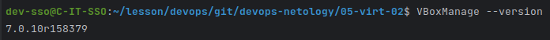
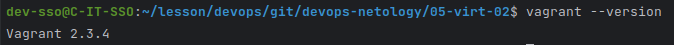
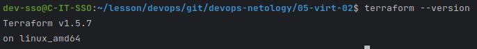
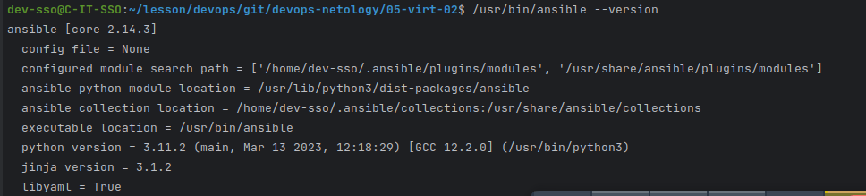
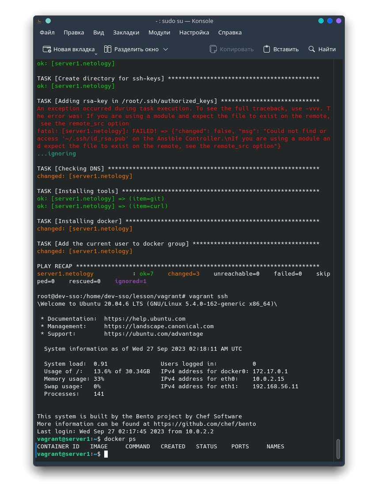

**Задача 1.**

* Скорость, масштабируемость, стабильность, восстановление в аварийных ситуациях.
* Идемпотентность (команда возвращает один и тот же результат)

**Задача 2.** 

* Более проста в освоении, имеет хорошую документацию, не требует установки агентов, написана на python и может расширяться с помощью модулей.
* Думаю что push более надежен поскольку централизованное управление позволяет более наглядно мониторить ситуацию (ошибки и тд.) + нет зависимости от агента.

**Задача 3.**

*  

* 

* 

* 

**Задача 4.**

* 