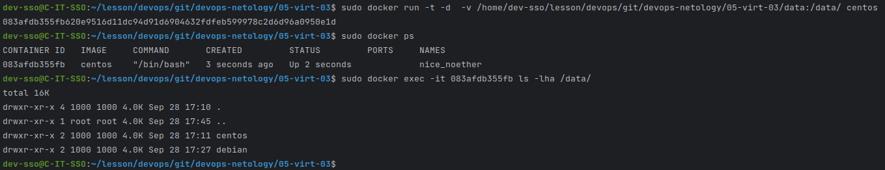
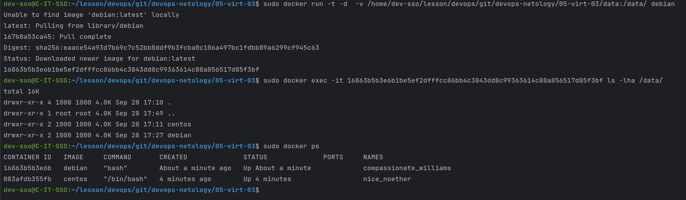
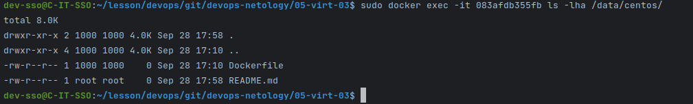

** Задача 1 **

- https://hub.docker.com/layers/sergeysergeevdevops/box/nginx/images/sha256-6ccaf021463a0adb69c16057877b8e9777ffdd4fea2d34f4ffe544656f65aa9f?context=repo

** Задача 2 **

- высоконагруженное монолитное Java веб-приложение:

    `Скорее всего лучше подойдет виртуальная машина поскольку приложение высоконагруженное стоит использовать как можно меньше дополнительных уровней абстракции.`

    `Масштабируется за счет увеличения аппаратных рессурсов.`
    
    `И поскольку монолит, то нет необходимости разгораничивать работу отдельных частей приложения.`

- Nodejs веб-приложение:

    `Думаю тут можно использовать контейнеры, поскольку не сказано что все крутится в одном процессе + можно будет легко масштабировать проект.`

- мобильное приложение c версиями для Android и iOS:

    `Думаю тут лучшим решением будет использовать контейнеры поскольку есть разные версии приложения, которые будут требовать свои зависимости`

    `Так же использование контейнеров позволит не зависеть от работы отдельных частей приложения и проблемы их масштабирования`

- шина данных на базе Apache Kafka:

    `Я не совсем разобрался с этим вопросом.. Я понял что шина данных должна обрабатывать большое количество операция на чтение и запись.`

    `Могу предположить что физический сервер может подойти лучше для операций связанных с чтением\записью на диск, но не уверен что правильно все понял`

- Elasticsearch-кластер для реализации логирования продуктивного веб-приложения — три ноды elasticsearch, два logstash и две ноды kibana:

    `Думаю тут я бы совместил реализацию контейнеров на ВМ для большей отказоустойчивости поскольку контейнеры в рамках взаимодействия не привязаны к хостам.`

    `К примеру, каждая нода - это отдельная ВМ на которой в контейнерах крутятся сервисы и все управляется через Kubernetes`

- мониторинг-стек на базе Prometheus и Grafana:

    `Думаю лучшим решением будет использование контейнеров но на разных ВМ чтобы разграничить функционал + к grafana может взаимдействовать не только с prometheus`

- MongoDB как основное хранилище данных для Java-приложения:

    `Тут отдельная ВМ поскольку обращений к основной БД будет много лучше использовать все выделенные ресурсы.`

- Gitlab-сервер для реализации CI/CD-процессов и приватный (закрытый) Docker Registry:

    `Думаю Gitlab-сервер и Docker Registry должны быть на разных серверах (ВМ) поскольку этот повысит отказоустойчивость и безопасность.`
   
    `Но не уверен в использовании контейнеров для реализации, поскорльку не совсем понимаю как будет реализовано хранение данных`

**Задача 3**

 - connecting /data to a container centos: 

 - connecting /data to a container debian: 

 - Create file from docker container: 

**Задача 4**

 - https://hub.docker.com/layers/sergeysergeevdevops/box/ansible/images/sha256-bf0d8d6211f6442e7622e047de033ccb292a8261cd248ad9ae9a9d1cde70e779?context=repo
