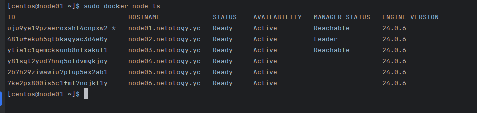
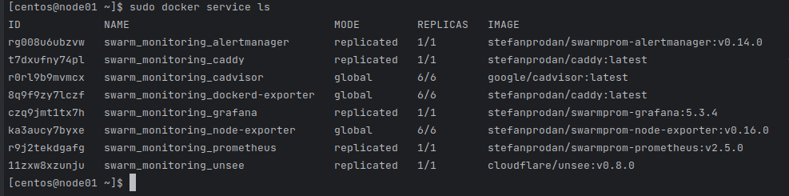
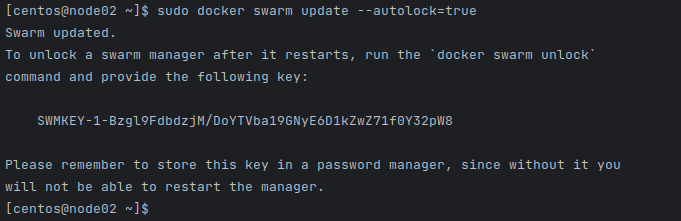

**Задача 1**

1.  - replication  - мы явно указываем количество реплик сервиса, которые хотим запустить. Они распределяются по нодам и контролируется менеджером
    - global - запускается одна реплика на каждом узле, заранее заданного количества реплик нет. При этом на каждой новой ноде будет запускаться таже задача как и на всех остальных.
  
2.  - В Docker Swarm кластере используется алгоритм поддержания распределенного консенсуса — Raft. Если менеджеры не слышат лидера, они отправляет остальным нодам запрос на голосование и так выбирают лидера.

3.  - В Docker Swarm используется "Алгоритм консенсуса Raft" - Overlay network - это внутренняя виртуальная сеть docker swarm, которая упрощает взаимодействие узлов между собой.

**Задача 2**

**Задача 3**

**Задача 4**

- Команда включает автоблокировку при перезапуске Docker и генерирует ключ для разблокировки. 
- Как я понял, используется для защиты ключа шифрования журналов Raft и TLS.

