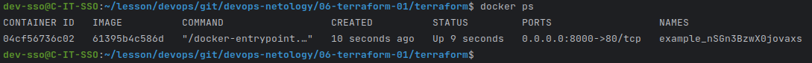
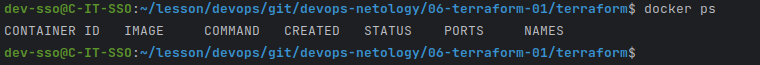
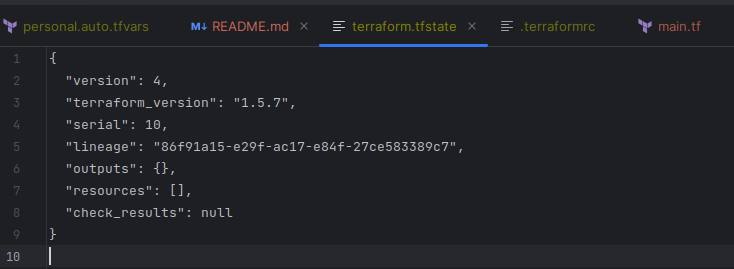
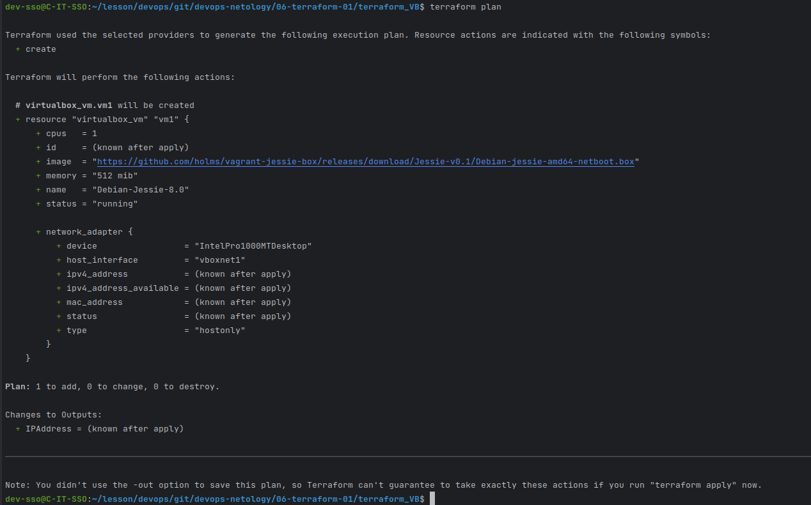
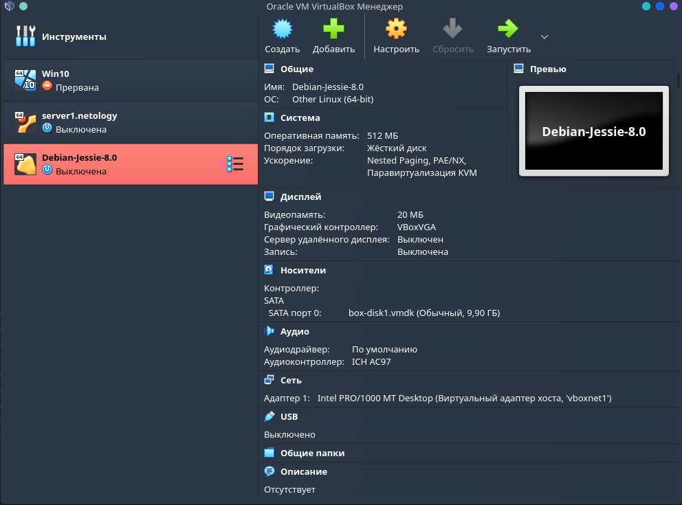

### **Задание 1**

 - Согласно ***.gitifnore*** в  файле ***personal.auto.tfvars*** можно хранить персональные данные.
 - Секретное содержимое **random_password** ---> ***"result": "nSGn3BzwX0jovaxs"***
 -  1. Отсутствие name для ресурса ***"docker_image"*** (Заменено на **nginx**)
    2. Не правильное имя ресурса ***"docker_container"*** (Заменено на **nginx**)
    3. Не верное задание значение через параметр ***random_password.random_string*** (Заменено на **random_password.random_string.result**)
 - Вывод команды `docker ps`:
    
 - При выполнении команды `terraform apply -auto-approve` произошло удаление контейнера с ***nginx*** поскольку его нет в конфигурации и попытка создания контейнера с ***hello_word***, но возник конфликт имен поскольку указанное имя уже используется в контейнере.
 - Вывод команды `docker ps`:
    
 - Содержимое файла terraform.tfstate:
    
 - У нас установлено значение `keep_locally = true` ---> Согласно документации:
    
    `(Boolean) If true, then the Docker image won't be deleted on destroy operation. If this is false, it will delete the image from the docker local storage on destroy operation.`

### **Задание 2**

- **plan** для создаваемого ресурса:

- скриншот созданного в VB ресурса:

