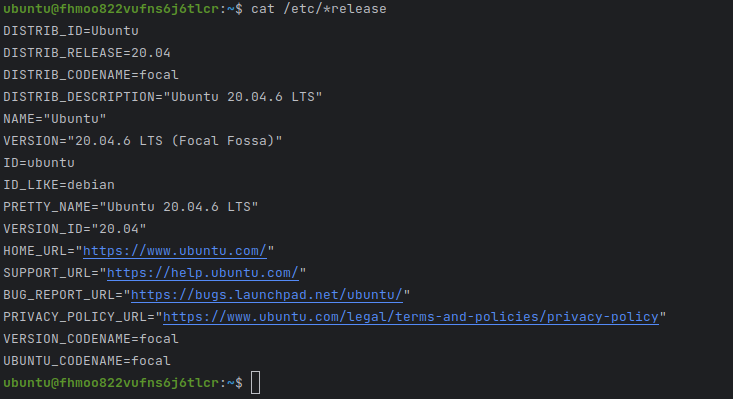
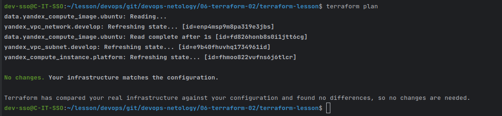
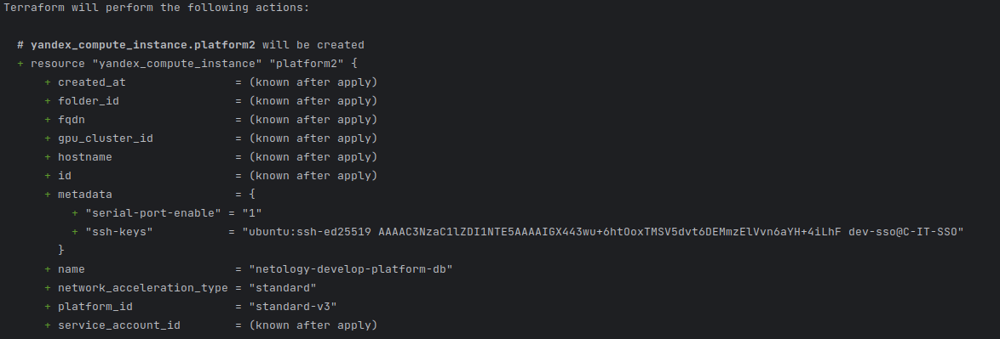
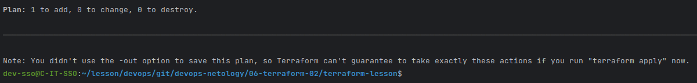
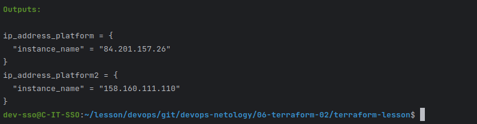
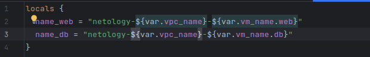
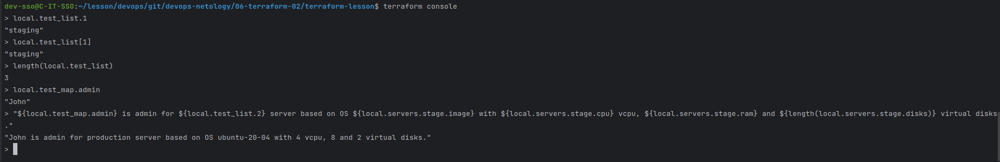

### ***Задание 1***

 - 
 - 
 - Ответы на вопросы:
    - ``preemptible = true`` -- делает ВМ прерываемой, это может поспособствовать снижению затрат на использование ВМ, поскольку в неактивном состоянии денежных средств расходуется меньше.
    - ``core_fraction=5`` -- насколько я понял, задает процент использования CPU, что так же ограничивает расход ДС на аккаунте.

### ***Задание 2***

- 
- [---> main.tf](./terraform-lesson/main.tf)
- 

### ***Задание 3***

- 
- 
- [---> main.tf](./terraform-lesson/main.tf)
- [---> vms_platform.tf](./terraform-lesson/vms_platform.tf)

### ***Задание 4***

- 
- [---> outputs.tf](./terraform-lesson/outputs.tf)

### ***Задание 5***

- 
- [---> locals.tf](./terraform-lesson/locals.tf)

### ***Задание 6***

- [---> vms_platform.tf](./terraform-lesson/vms_platform.tf)
- [---> variables.tf](./terraform-lesson/variables.tf)

### ***Задание 7***

- 