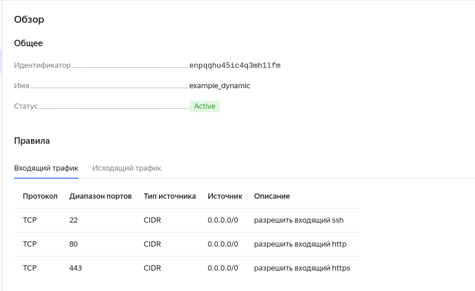
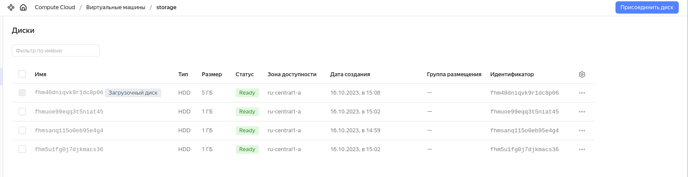

### ***Задание 1***

### ***Задание 2***

- Вывод команды ``terrafor plan``: 

    dev-sso@C-IT-SSO:~/lesson/devops/git/devops-netology/06-terraform-03/terraform$ terraform plan
    data.yandex_compute_image.ubuntu: Reading...
    yandex_vpc_network.develop: Refreshing state... [id=enpdl26r7dt0rk9o72ts]
    data.yandex_compute_image.ubuntu: Read complete after 0s [id=fd826honb8s0i1jtt6cg]
    yandex_vpc_subnet.develop: Refreshing state... [id=e9bjv10n9d9omh1im3eq]
    yandex_vpc_security_group.example: Refreshing state... [id=enpqqhu45ic4q3mh1lfm]
    
    Terraform used the selected providers to generate the following execution plan. Resource actions are indicated with the following symbols:
      + create
    
    Terraform will perform the following actions:
    
      # yandex_compute_disk.disks["main-sda"] will be created
      + resource "yandex_compute_disk" "disks" {
          + block_size  = 4096
          + created_at  = (known after apply)
          + folder_id   = (known after apply)
          + id          = (known after apply)
          + name        = "main-sda"
          + product_ids = (known after apply)
          + size        = 10
          + status      = (known after apply)
          + type        = "network-hdd"
          + zone        = (known after apply)
        }
    
      # yandex_compute_disk.disks["main-sdb"] will be created
      + resource "yandex_compute_disk" "disks" {
          + block_size  = 4096
          + created_at  = (known after apply)
          + folder_id   = (known after apply)
          + id          = (known after apply)
          + name        = "main-sdb"
          + product_ids = (known after apply)
          + size        = 15
          + status      = (known after apply)
          + type        = "network-hdd"
          + zone        = (known after apply)
        }
    
      # yandex_compute_disk.disks["replica-sda"] will be created
      + resource "yandex_compute_disk" "disks" {
          + block_size  = 4096
          + created_at  = (known after apply)
          + folder_id   = (known after apply)
          + id          = (known after apply)
          + name        = "replica-sda"
          + product_ids = (known after apply)
          + size        = 20
          + status      = (known after apply)
          + type        = "network-hdd"
          + zone        = (known after apply)
        }
    
      # yandex_compute_instance.web[0] will be created
      + resource "yandex_compute_instance" "web" {
          + created_at                = (known after apply)
          + folder_id                 = (known after apply)
          + fqdn                      = (known after apply)
          + gpu_cluster_id            = (known after apply)
          + hostname                  = (known after apply)
          + id                        = (known after apply)
          + metadata                  = {
              + "serial-port-enable" = "1"
              + "ssh-key"            = <<-EOT
                    ssh-ed25519 AAAAC3NzaC1lZDI1NTE5AAAAIGX443wu+6htOoxTMSV5dvt6DEMmzElVvn6aYH+4iLhF dev-sso@C-IT-SSO
                EOT
            }
          + name                      = "netology-develop-platform-web-1"
          + network_acceleration_type = "standard"
          + platform_id               = "standard-v3"
          + service_account_id        = (known after apply)
          + status                    = (known after apply)
          + zone                      = "ru-central1-a"
    
          + boot_disk {
              + auto_delete = true
              + device_name = (known after apply)
              + disk_id     = (known after apply)
              + mode        = (known after apply)
    
              + initialize_params {
                  + block_size  = (known after apply)
                  + description = (known after apply)
                  + image_id    = "fd826honb8s0i1jtt6cg"
                  + name        = (known after apply)
                  + size        = (known after apply)
                  + snapshot_id = (known after apply)
                  + type        = "network-hdd"
                }
            }
    
          + network_interface {
              + index              = (known after apply)
              + ip_address         = (known after apply)
              + ipv4               = true
              + ipv6               = (known after apply)
              + ipv6_address       = (known after apply)
              + mac_address        = (known after apply)
              + nat                = false
              + nat_ip_address     = (known after apply)
              + nat_ip_version     = (known after apply)
              + security_group_ids = [
                  + "enpqqhu45ic4q3mh1lfm",
                ]
              + subnet_id          = "e9bjv10n9d9omh1im3eq"
            }
    
          + resources {
              + core_fraction = 20
              + cores         = 2
              + memory        = 1
            }
    
          + scheduling_policy {
              + preemptible = true
            }
        }
    
      # yandex_compute_instance.web[1] will be created
      + resource "yandex_compute_instance" "web" {
          + created_at                = (known after apply)
          + folder_id                 = (known after apply)
          + fqdn                      = (known after apply)
          + gpu_cluster_id            = (known after apply)
          + hostname                  = (known after apply)
          + id                        = (known after apply)
          + metadata                  = {
              + "serial-port-enable" = "1"
              + "ssh-key"            = <<-EOT
                    ssh-ed25519 AAAAC3NzaC1lZDI1NTE5AAAAIGX443wu+6htOoxTMSV5dvt6DEMmzElVvn6aYH+4iLhF dev-sso@C-IT-SSO
                EOT
            }
          + name                      = "netology-develop-platform-web-2"
          + network_acceleration_type = "standard"
          + platform_id               = "standard-v3"
          + service_account_id        = (known after apply)
          + status                    = (known after apply)
          + zone                      = "ru-central1-a"
    
          + boot_disk {
              + auto_delete = true
              + device_name = (known after apply)
              + disk_id     = (known after apply)
              + mode        = (known after apply)
    
              + initialize_params {
                  + block_size  = (known after apply)
                  + description = (known after apply)
                  + image_id    = "fd826honb8s0i1jtt6cg"
                  + name        = (known after apply)
                  + size        = (known after apply)
                  + snapshot_id = (known after apply)
                  + type        = "network-hdd"
                }
            }
    
          + network_interface {
              + index              = (known after apply)
              + ip_address         = (known after apply)
              + ipv4               = true
              + ipv6               = (known after apply)
              + ipv6_address       = (known after apply)
              + mac_address        = (known after apply)
              + nat                = false
              + nat_ip_address     = (known after apply)
              + nat_ip_version     = (known after apply)
              + security_group_ids = [
                  + "enpqqhu45ic4q3mh1lfm",
                ]
              + subnet_id          = "e9bjv10n9d9omh1im3eq"
            }
    
          + resources {
              + core_fraction = 20
              + cores         = 2
              + memory        = 1
            }
    
          + scheduling_policy {
              + preemptible = true
            }
        }
    
      # yandex_compute_instance.web_instance["main"] will be created
      + resource "yandex_compute_instance" "web_instance" {
          + created_at                = (known after apply)
          + folder_id                 = (known after apply)
          + fqdn                      = (known after apply)
          + gpu_cluster_id            = (known after apply)
          + hostname                  = (known after apply)
          + id                        = (known after apply)
          + metadata                  = {
              + "serial-port-enable" = "1"
              + "ssh-key"            = <<-EOT
                    ssh-ed25519 AAAAC3NzaC1lZDI1NTE5AAAAIGX443wu+6htOoxTMSV5dvt6DEMmzElVvn6aYH+4iLhF dev-sso@C-IT-SSO
                EOT
            }
          + name                      = "netology-develop-platform-web-main"
          + network_acceleration_type = "standard"
          + platform_id               = "standard-v3"
          + service_account_id        = (known after apply)
          + status                    = (known after apply)
          + zone                      = "ru-central1-a"
    
          + boot_disk {
              + auto_delete = true
              + device_name = (known after apply)
              + disk_id     = (known after apply)
              + mode        = (known after apply)
    
              + initialize_params {
                  + block_size  = (known after apply)
                  + description = (known after apply)
                  + image_id    = "fd826honb8s0i1jtt6cg"
                  + name        = (known after apply)
                  + size        = (known after apply)
                  + snapshot_id = (known after apply)
                  + type        = "network-hdd"
                }
            }
    
          + network_interface {
              + index              = (known after apply)
              + ip_address         = (known after apply)
              + ipv4               = true
              + ipv6               = (known after apply)
              + ipv6_address       = (known after apply)
              + mac_address        = (known after apply)
              + nat                = false
              + nat_ip_address     = (known after apply)
              + nat_ip_version     = (known after apply)
              + security_group_ids = [
                  + "enpqqhu45ic4q3mh1lfm",
                ]
              + subnet_id          = "e9bjv10n9d9omh1im3eq"
            }
    
          + resources {
              + core_fraction = 20
              + cores         = 2
              + memory        = 2
            }
    
          + scheduling_policy {
              + preemptible = true
            }
    
          + secondary_disk {
              + auto_delete = true
              + device_name = "main-sda"
              + disk_id     = (known after apply)
              + mode        = "READ_WRITE"
            }
          + secondary_disk {
              + auto_delete = true
              + device_name = "main-sdb"
              + disk_id     = (known after apply)
              + mode        = "READ_WRITE"
            }
        }
    
      # yandex_compute_instance.web_instance["replica"] will be created
      + resource "yandex_compute_instance" "web_instance" {
          + created_at                = (known after apply)
          + folder_id                 = (known after apply)
          + fqdn                      = (known after apply)
          + gpu_cluster_id            = (known after apply)
          + hostname                  = (known after apply)
          + id                        = (known after apply)
          + metadata                  = {
              + "serial-port-enable" = "1"
              + "ssh-key"            = <<-EOT
                    ssh-ed25519 AAAAC3NzaC1lZDI1NTE5AAAAIGX443wu+6htOoxTMSV5dvt6DEMmzElVvn6aYH+4iLhF dev-sso@C-IT-SSO
                EOT
            }
          + name                      = "netology-develop-platform-web-replica"
          + network_acceleration_type = "standard"
          + platform_id               = "standard-v3"
          + service_account_id        = (known after apply)
          + status                    = (known after apply)
          + zone                      = "ru-central1-a"
    
          + boot_disk {
              + auto_delete = true
              + device_name = (known after apply)
              + disk_id     = (known after apply)
              + mode        = (known after apply)
    
              + initialize_params {
                  + block_size  = (known after apply)
                  + description = (known after apply)
                  + image_id    = "fd826honb8s0i1jtt6cg"
                  + name        = (known after apply)
                  + size        = (known after apply)
                  + snapshot_id = (known after apply)
                  + type        = "network-hdd"
                }
            }
    
          + network_interface {
              + index              = (known after apply)
              + ip_address         = (known after apply)
              + ipv4               = true
              + ipv6               = (known after apply)
              + ipv6_address       = (known after apply)
              + mac_address        = (known after apply)
              + nat                = false
              + nat_ip_address     = (known after apply)
              + nat_ip_version     = (known after apply)
              + security_group_ids = [
                  + "enpqqhu45ic4q3mh1lfm",
                ]
              + subnet_id          = "e9bjv10n9d9omh1im3eq"
            }
    
          + resources {
              + core_fraction = 20
              + cores         = 2
              + memory        = 2
            }
    
          + scheduling_policy {
              + preemptible = true
            }
    
          + secondary_disk {
              + auto_delete = true
              + device_name = "replica-sda"
              + disk_id     = (known after apply)
              + mode        = "READ_WRITE"
            }
        }
    
    Plan: 7 to add, 0 to change, 0 to destroy.

 - 
 - 
 - [----> for_each-vm.tf](./terraform/for_each-vm.tf)
 - [----> locals.tf](./terraform/locals.tf)
 - [----> locals.tf](./terraform/count-vm.tf)

### ***Задание 3***

 - 
 -  [----> disk_vm.tf](./terraform/disk_vm.tf)

### ***Задание 4***

 - 
 - [----> ansible.cfg](./terraform/ansible.cfg)
 - [----> ansible.tf](./terraform/ansible.tf)
 - [----> ansible.tftpl](./terraform/ansible.tftpl)