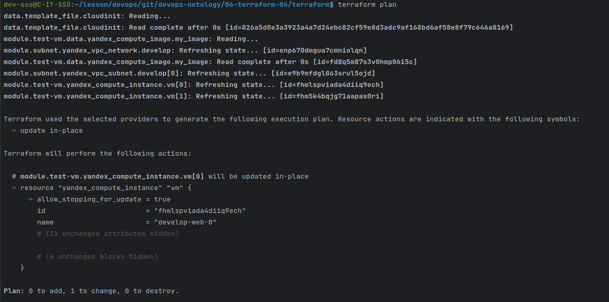

### ***Задание 1***

 - 

### ***Задание 2***

 - 
   - [modules/vpc](./terraform/modules/vpc)

   ````
    module "subnet" {
        source = "./modules/vpc"
        name = var.vpc_name
        zone = var.default_zone
        v4_cidr_blocks = var.default_cidr
    }
   
### ***Задание 3***

 - 
 - 
 - 
 - 
 - 
 - 
 - 

### ***Задание 4***

   - terraform plan:
      ````  
            dev-sso@C-IT-SSO:~/lesson/devops/git/devops-netology/06-terraform-04/terraform$ terraform plan
            data.template_file.cloudinit: Reading...
            data.template_file.cloudinit: Read complete after 0s [id=826a5d0e3a3923a4a7d24ebc82cf59e8d3adc9af168bd6af58e8f79c646a8169]
            module.subnet.yandex_vpc_network.develop: Refreshing state... [id=enp6boh2fhuhv0oih9bh]
            module.test-vm.data.yandex_compute_image.my_image: Reading...
            module.test-vm.data.yandex_compute_image.my_image: Read complete after 0s [id=fd8q5m87s3v0hmp06i5c]
            module.subnet.yandex_vpc_subnet.develop[0]: Refreshing state... [id=e9btvr43mmevi3af5ev2]
            module.test-vm.yandex_compute_instance.vm[1]: Refreshing state... [id=fhmvii3lgvcguupmpbv4]
            module.test-vm.yandex_compute_instance.vm[0]: Refreshing state... [id=fhmp372uejr3e4sufb03]
            
            Terraform used the selected providers to generate the following execution plan. Resource actions are indicated with the following symbols:
              + create
              ~ update in-place
            
            Terraform will perform the following actions:
            
              # module.subnet.yandex_vpc_subnet.develop[1] will be created
              + resource "yandex_vpc_subnet" "develop" {
                  + created_at     = (known after apply)
                  + folder_id      = (known after apply)
                  + id             = (known after apply)
                  + labels         = (known after apply)
                  + name           = "web-net"
                  + network_id     = "enp6boh2fhuhv0oih9bh"
                  + v4_cidr_blocks = [
                      + "10.77.2.0/24",
                    ]
                  + v6_cidr_blocks = (known after apply)
                  + zone           = "ru-central1-b"
                }
            
              # module.subnet.yandex_vpc_subnet.develop[2] will be created
              + resource "yandex_vpc_subnet" "develop" {
                  + created_at     = (known after apply)
                  + folder_id      = (known after apply)
                  + id             = (known after apply)
                  + labels         = (known after apply)
                  + name           = "web-net"
                  + network_id     = "enp6boh2fhuhv0oih9bh"
                  + v4_cidr_blocks = [
                      + "10.77.3.0/24",
                    ]
                  + v6_cidr_blocks = (known after apply)
                  + zone           = "ru-central1-c"
                }
            
              # module.test-vm.yandex_compute_instance.vm[1] will be updated in-place
              ~ resource "yandex_compute_instance" "vm" {
                    id                        = "fhmvii3lgvcguupmpbv4"
                    name                      = "develop-web-1"
                    # (12 unchanged attributes hidden)
            
                  ~ network_interface {
                      ~ subnet_id          = "e9btvr43mmevi3af5ev2" -> (known after apply)
                        # (9 unchanged attributes hidden)
                    }
            
                    # (5 unchanged blocks hidden)
                }
            
              # module.vpc_dev.yandex_vpc_network.develop will be created
              + resource "yandex_vpc_network" "develop" {
                  + created_at                = (known after apply)
                  + default_security_group_id = (known after apply)
                  + folder_id                 = (known after apply)
                  + id                        = (known after apply)
                  + labels                    = (known after apply)
                  + name                      = "vpc_dev"
                  + subnet_ids                = (known after apply)
                }
            
              # module.vpc_dev.yandex_vpc_subnet.develop[0] will be created
              + resource "yandex_vpc_subnet" "develop" {
                  + created_at     = (known after apply)
                  + folder_id      = (known after apply)
                  + id             = (known after apply)
                  + labels         = (known after apply)
                  + name           = "vpc_dev"
                  + network_id     = (known after apply)
                  + v4_cidr_blocks = [
                      + "10.77.10.0/24",
                    ]
                  + v6_cidr_blocks = (known after apply)
                  + zone           = "ru-central1-a"
                }
            
            Plan: 4 to add, 1 to change, 0 to destroy.

   - 
   - 

   - [modules/vpc](./terraform/modules/vpc)

### ***Задание 5***
 - Значение HA - false:

        dev-sso@C-IT-SSO:~/lesson/devops/git/devops-netology/06-terraform-04/terraform$ terraform plan
        data.template_file.cloudinit: Reading...
        data.template_file.cloudinit: Read complete after 0s [id=826a5d0e3a3923a4a7d24ebc82cf59e8d3adc9af168bd6af58e8f79c646a8169]
        module.test-vm.data.yandex_compute_image.my_image: Reading...
        module.subnet.yandex_vpc_network.develop: Refreshing state... [id=enps0rgvd4lqknd70miq]
        module.vpc_dev.yandex_vpc_network.develop: Refreshing state... [id=enpi6c1lc7pdlro75v9k]
        module.test-vm.data.yandex_compute_image.my_image: Read complete after 1s [id=fd8q5m87s3v0hmp06i5c]
        module.vpc_dev.yandex_vpc_subnet.develop[0]: Refreshing state... [id=e9b61i24u4nfd7hl9j44]
        module.subnet.yandex_vpc_subnet.develop[2]: Refreshing state... [id=b0ccm41ri4ohmcss4njh]
        module.subnet.yandex_vpc_subnet.develop[1]: Refreshing state... [id=e2li20dk7d85b91koe51]
        module.subnet.yandex_vpc_subnet.develop[0]: Refreshing state... [id=e9bc7dphghd0cpd6frts]
        module.test-vm.yandex_compute_instance.vm[1]: Refreshing state... [id=fhm6tc4lebi6nb7lijs0]
        module.test-vm.yandex_compute_instance.vm[0]: Refreshing state... [id=fhmi9sr4kmjcnl1etg1r]
        
        Terraform used the selected providers to generate the following execution plan. Resource actions are indicated with the following symbols:
          + create
        
        Terraform will perform the following actions:
        
          # module.mysql-cluster.yandex_mdb_mysql_cluster.mysql-cluster[0] will be created
          + resource "yandex_mdb_mysql_cluster" "mysql-cluster" {
              + allow_regeneration_host   = false
              + backup_retain_period_days = (known after apply)
              + created_at                = (known after apply)
              + deletion_protection       = (known after apply)
              + environment               = "PRESTABLE"
              + folder_id                 = (known after apply)
              + health                    = (known after apply)
              + host_group_ids            = (known after apply)
              + id                        = (known after apply)
              + mysql_config              = (known after apply)
              + name                      = "sql"
              + network_id                = "enpi6c1lc7pdlro75v9k"
              + status                    = (known after apply)
              + version                   = "8.0"
        
              + host {
                  + assign_public_ip   = false
                  + fqdn               = (known after apply)
                  + replication_source = (known after apply)
                  + subnet_id          = "e9b61i24u4nfd7hl9j44"
                  + zone               = "ru-central1-a"
                }
        
              + resources {
                  + disk_size          = 16
                  + disk_type_id       = "network-ssd"
                  + resource_preset_id = "s2.micro"
                }
            }
        
          # module.mysql-db.yandex_mdb_mysql_database.my-db will be created
          + resource "yandex_mdb_mysql_database" "my-db" {
              + cluster_id = (known after apply)
              + id         = (known after apply)
              + name       = "test_db"
            }
        
          # module.mysql-db.yandex_mdb_mysql_user.db_user will be created
          + resource "yandex_mdb_mysql_user" "db_user" {
              + authentication_plugin = (known after apply)
              + cluster_id            = (known after apply)
              + global_permissions    = (known after apply)
              + id                    = (known after apply)
              + name                  = "user"
              + password              = (sensitive value)
        
              + permission {
                  + database_name = "test_db"
                  + roles         = [
                      + "ALL",
                    ]
                }
            }
        
        Plan: 3 to add, 0 to change, 0 to destroy.

 - Значение HA - true:


      dev-sso@C-IT-SSO:~/lesson/devops/git/devops-netology/06-terraform-04/terraform$ terraform plan
      data.template_file.cloudinit: Reading...
      data.template_file.cloudinit: Read complete after 0s [id=826a5d0e3a3923a4a7d24ebc82cf59e8d3adc9af168bd6af58e8f79c646a8169]
      module.test-vm.data.yandex_compute_image.my_image: Reading...
      module.vpc_dev.yandex_vpc_network.develop: Refreshing state... [id=enpi6c1lc7pdlro75v9k]
      module.subnet.yandex_vpc_network.develop: Refreshing state... [id=enps0rgvd4lqknd70miq]
      module.test-vm.data.yandex_compute_image.my_image: Read complete after 1s [id=fd8q5m87s3v0hmp06i5c]
      module.subnet.yandex_vpc_subnet.develop[0]: Refreshing state... [id=e9bc7dphghd0cpd6frts]
      module.subnet.yandex_vpc_subnet.develop[1]: Refreshing state... [id=e2li20dk7d85b91koe51]
      module.subnet.yandex_vpc_subnet.develop[2]: Refreshing state... [id=b0ccm41ri4ohmcss4njh]
      module.vpc_dev.yandex_vpc_subnet.develop[0]: Refreshing state... [id=e9b61i24u4nfd7hl9j44]
      module.test-vm.yandex_compute_instance.vm[1]: Refreshing state... [id=fhm6tc4lebi6nb7lijs0]
      module.test-vm.yandex_compute_instance.vm[0]: Refreshing state... [id=fhmi9sr4kmjcnl1etg1r]
    
      Terraform used the selected providers to generate the following execution plan. Resource actions are indicated with the following symbols:
        + create
    
      Terraform will perform the following actions:
    
        # module.mysql-cluster.yandex_mdb_mysql_cluster.mysql-cluster[0] will be created
        + resource "yandex_mdb_mysql_cluster" "mysql-cluster" {
            + allow_regeneration_host   = false
            + backup_retain_period_days = (known after apply)
            + created_at                = (known after apply)
            + deletion_protection       = (known after apply)
            + environment               = "PRESTABLE"
            + folder_id                 = (known after apply)
            + health                    = (known after apply)
            + host_group_ids            = (known after apply)
            + id                        = (known after apply)
            + mysql_config              = (known after apply)
            + name                      = "sql"
            + network_id                = "enpi6c1lc7pdlro75v9k"
            + status                    = (known after apply)
            + version                   = "8.0"
    
            + host {
                + assign_public_ip   = false
                + fqdn               = (known after apply)
                + replication_source = (known after apply)
                + subnet_id          = "e9b61i24u4nfd7hl9j44"
                + zone               = "ru-central1-a"
              }
    
            + resources {
                + disk_size          = 16
                + disk_type_id       = "network-ssd"
                + resource_preset_id = "s2.micro"
              }
          }
    
        # module.mysql-cluster.yandex_mdb_mysql_cluster.mysql-cluster[1] will be created
        + resource "yandex_mdb_mysql_cluster" "mysql-cluster" {
            + allow_regeneration_host   = false
            + backup_retain_period_days = (known after apply)
            + created_at                = (known after apply)
            + deletion_protection       = (known after apply)
            + environment               = "PRESTABLE"
            + folder_id                 = (known after apply)
            + health                    = (known after apply)
            + host_group_ids            = (known after apply)
            + id                        = (known after apply)
            + mysql_config              = (known after apply)
            + name                      = "sql"
            + network_id                = "enpi6c1lc7pdlro75v9k"
            + status                    = (known after apply)
            + version                   = "8.0"
    
            + host {
                + assign_public_ip   = false
                + fqdn               = (known after apply)
                + replication_source = (known after apply)
                + subnet_id          = "e9b61i24u4nfd7hl9j44"
                + zone               = "ru-central1-a"
              }
    
            + resources {
                + disk_size          = 16
                + disk_type_id       = "network-ssd"
                + resource_preset_id = "s2.micro"
              }
          }
    
        # module.mysql-db.yandex_mdb_mysql_database.my-db will be created
        + resource "yandex_mdb_mysql_database" "my-db" {
            + cluster_id = (known after apply)
            + id         = (known after apply)
            + name       = "test_db"
          }
    
        # module.mysql-db.yandex_mdb_mysql_user.db_user will be created
        + resource "yandex_mdb_mysql_user" "db_user" {
            + authentication_plugin = (known after apply)
            + cluster_id            = (known after apply)
            + global_permissions    = (known after apply)
            + id                    = (known after apply)
            + name                  = "user"
            + password              = (sensitive value)
    
            + permission {
                + database_name = "test_db"
                + roles         = [
                    + "ALL",
                  ]
              }
          }
    
      Plan: 4 to add, 0 to change, 0 to destroy.


 - [modules/mysql_cluster](./terraform/modules/mysql_cluster)
 - [modules/mysql_db](./terraform/modules/mysql_db)

   ````Plan: 11 to add, 0 to change, 0 to destroy.
   ╷
   │ Warning: Version constraints inside provider configuration blocks are deprecated
   │ 
   │   on .terraform/modules/test-vm/providers.tf line 2, in provider "template":
   │    2:   version = "2.2.0"
   │ 
   │ Terraform 0.13 and earlier allowed provider version constraints inside the provider configuration block, but that is now deprecated and will be removed in a future version of Terraform. To silence this warning, move the
   │ provider version constraint into the required_providers block.
   ╵
   
   Do you want to perform these actions?
     Terraform will perform the actions described above.
     Only 'yes' will be accepted to approve.
   
     Enter a value: yes
   
   module.subnet.yandex_vpc_network.develop: Creating...
   module.vpc_dev.yandex_vpc_network.develop: Creating...
   module.vpc_dev.yandex_vpc_network.develop: Creation complete after 2s [id=enpape5foraml0uu2fdo]
   module.vpc_dev.yandex_vpc_subnet.develop[0]: Creating...
   module.subnet.yandex_vpc_network.develop: Creation complete after 3s [id=enp855t8tpt4o5gtle1e]
   module.subnet.yandex_vpc_subnet.develop[1]: Creating...
   module.subnet.yandex_vpc_subnet.develop[0]: Creating...
   module.subnet.yandex_vpc_subnet.develop[2]: Creating...
   module.vpc_dev.yandex_vpc_subnet.develop[0]: Creation complete after 1s [id=e9b4c5h38nc735ej206m]
   module.mysql-cluster.yandex_mdb_mysql_cluster.mysql-cluster: Creating...
   module.test-vm.yandex_compute_instance.vm[0]: Creating...
   module.test-vm.yandex_compute_instance.vm[1]: Creating...
   module.subnet.yandex_vpc_subnet.develop[0]: Creation complete after 1s [id=e9b047hr5k6mghffb6ih]
   module.subnet.yandex_vpc_subnet.develop[1]: Creation complete after 1s [id=e2lqc5meucfoce3pe7ok]
   module.subnet.yandex_vpc_subnet.develop[2]: Creation complete after 2s [id=b0cgao0p2qdrfrai9lp1]
   module.mysql-cluster.yandex_mdb_mysql_cluster.mysql-cluster: Still creating... [10s elapsed]
   module.test-vm.yandex_compute_instance.vm[0]: Still creating... [10s elapsed]
   module.test-vm.yandex_compute_instance.vm[1]: Still creating... [10s elapsed]
   module.mysql-cluster.yandex_mdb_mysql_cluster.mysql-cluster: Still creating... [20s elapsed]
   module.test-vm.yandex_compute_instance.vm[0]: Still creating... [20s elapsed]
   module.test-vm.yandex_compute_instance.vm[1]: Still creating... [20s elapsed]
   module.mysql-cluster.yandex_mdb_mysql_cluster.mysql-cluster: Still creating... [30s elapsed]
   module.test-vm.yandex_compute_instance.vm[1]: Still creating... [30s elapsed]
   module.test-vm.yandex_compute_instance.vm[0]: Still creating... [30s elapsed]
   module.test-vm.yandex_compute_instance.vm[1]: Creation complete after 35s [id=fhmgmqtptj37i2vrat49]
   module.test-vm.yandex_compute_instance.vm[0]: Creation complete after 38s [id=fhmlno827v7n89d3ehhu]
   module.mysql-cluster.yandex_mdb_mysql_cluster.mysql-cluster: Still creating... [40s elapsed]
   module.mysql-cluster.yandex_mdb_mysql_cluster.mysql-cluster: Still creating... [50s elapsed]
   module.mysql-cluster.yandex_mdb_mysql_cluster.mysql-cluster: Still creating... [1m0s elapsed]
   module.mysql-cluster.yandex_mdb_mysql_cluster.mysql-cluster: Still creating... [1m10s elapsed]
   module.mysql-cluster.yandex_mdb_mysql_cluster.mysql-cluster: Still creating... [1m20s elapsed]
   module.mysql-cluster.yandex_mdb_mysql_cluster.mysql-cluster: Still creating... [1m30s elapsed]
   module.mysql-cluster.yandex_mdb_mysql_cluster.mysql-cluster: Still creating... [1m40s elapsed]
   module.mysql-cluster.yandex_mdb_mysql_cluster.mysql-cluster: Still creating... [1m50s elapsed]
   module.mysql-cluster.yandex_mdb_mysql_cluster.mysql-cluster: Still creating... [2m0s elapsed]
   module.mysql-cluster.yandex_mdb_mysql_cluster.mysql-cluster: Still creating... [2m10s elapsed]
   module.mysql-cluster.yandex_mdb_mysql_cluster.mysql-cluster: Still creating... [2m20s elapsed]
   module.mysql-cluster.yandex_mdb_mysql_cluster.mysql-cluster: Still creating... [2m30s elapsed]
   module.mysql-cluster.yandex_mdb_mysql_cluster.mysql-cluster: Still creating... [2m40s elapsed]
   module.mysql-cluster.yandex_mdb_mysql_cluster.mysql-cluster: Still creating... [2m50s elapsed]
   module.mysql-cluster.yandex_mdb_mysql_cluster.mysql-cluster: Still creating... [3m0s elapsed]
   module.mysql-cluster.yandex_mdb_mysql_cluster.mysql-cluster: Still creating... [3m10s elapsed]
   module.mysql-cluster.yandex_mdb_mysql_cluster.mysql-cluster: Still creating... [3m20s elapsed]
   module.mysql-cluster.yandex_mdb_mysql_cluster.mysql-cluster: Still creating... [3m30s elapsed]
   module.mysql-cluster.yandex_mdb_mysql_cluster.mysql-cluster: Still creating... [3m40s elapsed]
   module.mysql-cluster.yandex_mdb_mysql_cluster.mysql-cluster: Still creating... [3m50s elapsed]
   module.mysql-cluster.yandex_mdb_mysql_cluster.mysql-cluster: Still creating... [4m0s elapsed]
   module.mysql-cluster.yandex_mdb_mysql_cluster.mysql-cluster: Still creating... [4m10s elapsed]
   module.mysql-cluster.yandex_mdb_mysql_cluster.mysql-cluster: Still creating... [4m20s elapsed]
   module.mysql-cluster.yandex_mdb_mysql_cluster.mysql-cluster: Still creating... [4m30s elapsed]
   module.mysql-cluster.yandex_mdb_mysql_cluster.mysql-cluster: Still creating... [4m40s elapsed]
   module.mysql-cluster.yandex_mdb_mysql_cluster.mysql-cluster: Still creating... [4m50s elapsed]
   module.mysql-cluster.yandex_mdb_mysql_cluster.mysql-cluster: Still creating... [5m0s elapsed]
   module.mysql-cluster.yandex_mdb_mysql_cluster.mysql-cluster: Still creating... [5m10s elapsed]
   module.mysql-cluster.yandex_mdb_mysql_cluster.mysql-cluster: Still creating... [5m20s elapsed]
   module.mysql-cluster.yandex_mdb_mysql_cluster.mysql-cluster: Still creating... [5m30s elapsed]
   module.mysql-cluster.yandex_mdb_mysql_cluster.mysql-cluster: Still creating... [5m40s elapsed]
   module.mysql-cluster.yandex_mdb_mysql_cluster.mysql-cluster: Still creating... [5m50s elapsed]
   module.mysql-cluster.yandex_mdb_mysql_cluster.mysql-cluster: Still creating... [6m0s elapsed]
   module.mysql-cluster.yandex_mdb_mysql_cluster.mysql-cluster: Still creating... [6m10s elapsed]
   module.mysql-cluster.yandex_mdb_mysql_cluster.mysql-cluster: Still creating... [6m20s elapsed]
   module.mysql-cluster.yandex_mdb_mysql_cluster.mysql-cluster: Still creating... [6m30s elapsed]
   module.mysql-cluster.yandex_mdb_mysql_cluster.mysql-cluster: Still creating... [6m40s elapsed]
   module.mysql-cluster.yandex_mdb_mysql_cluster.mysql-cluster: Still creating... [6m50s elapsed]
   module.mysql-cluster.yandex_mdb_mysql_cluster.mysql-cluster: Still creating... [7m0s elapsed]
   module.mysql-cluster.yandex_mdb_mysql_cluster.mysql-cluster: Still creating... [7m10s elapsed]
   module.mysql-cluster.yandex_mdb_mysql_cluster.mysql-cluster: Creation complete after 7m19s [id=c9qs9heplt8d7kihge6o]
   module.mysql-db.yandex_mdb_mysql_database.my-db: Creating...
   module.mysql-db.yandex_mdb_mysql_database.my-db: Still creating... [10s elapsed]
   module.mysql-db.yandex_mdb_mysql_database.my-db: Still creating... [20s elapsed]
   module.mysql-db.yandex_mdb_mysql_database.my-db: Still creating... [30s elapsed]
   module.mysql-db.yandex_mdb_mysql_database.my-db: Creation complete after 33s [id=c9qs9heplt8d7kihge6o:test_db]
   module.mysql-db.yandex_mdb_mysql_user.db_user: Creating...
   module.mysql-db.yandex_mdb_mysql_user.db_user: Still creating... [10s elapsed]
   module.mysql-db.yandex_mdb_mysql_user.db_user: Still creating... [20s elapsed]
   module.mysql-db.yandex_mdb_mysql_user.db_user: Creation complete after 27s [id=c9qs9heplt8d7kihge6o:user]
   
   Apply complete! Resources: 11 added, 0 changed, 0 destroyed.
   dev-sso@C-IT-SSO:~/lesson/devops/git/devops-netology/06-terraform-04/terraform$   

 - 

### ***Задание 6***