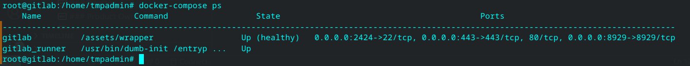
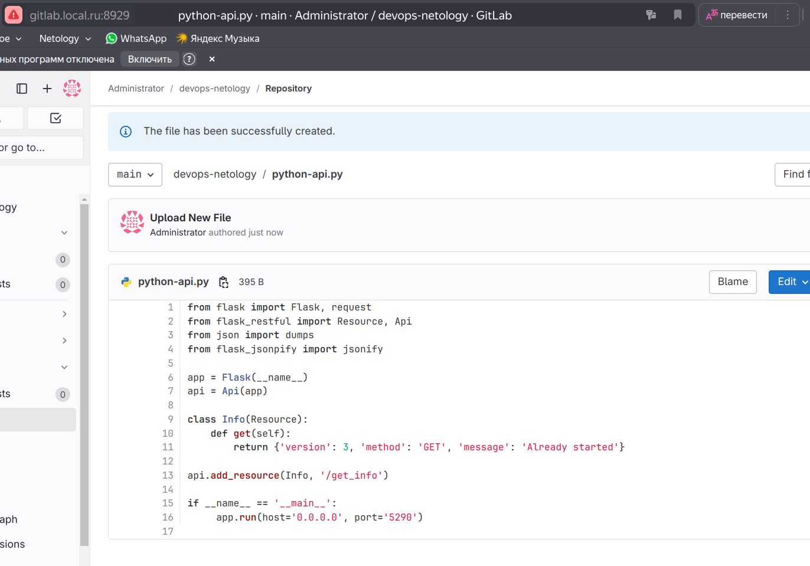
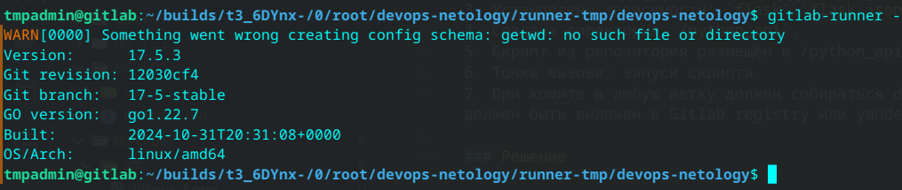
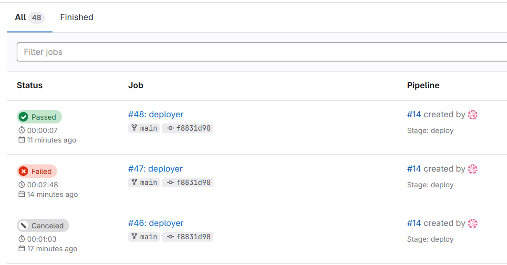
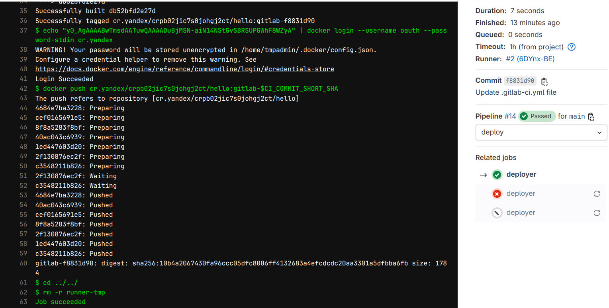
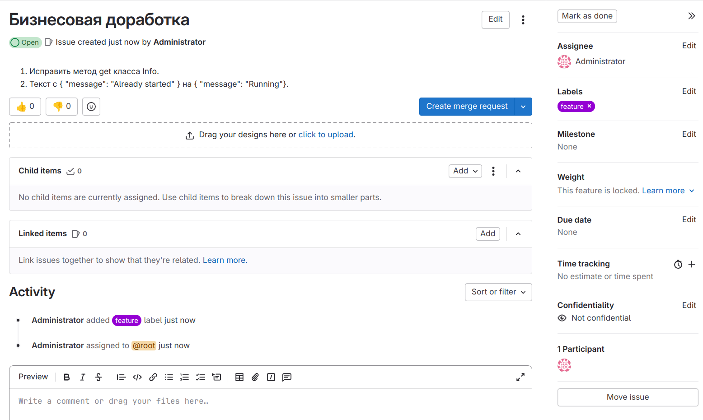
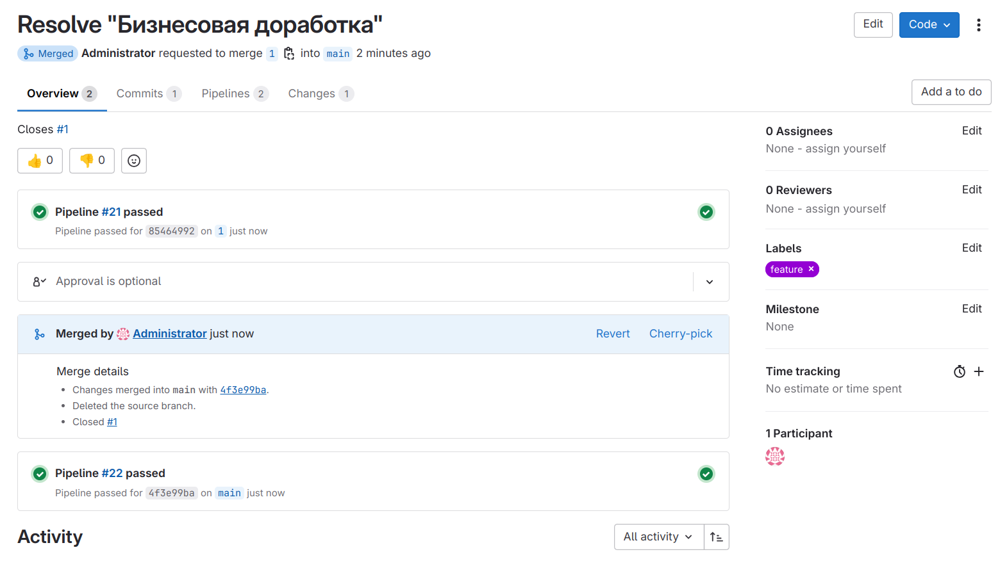
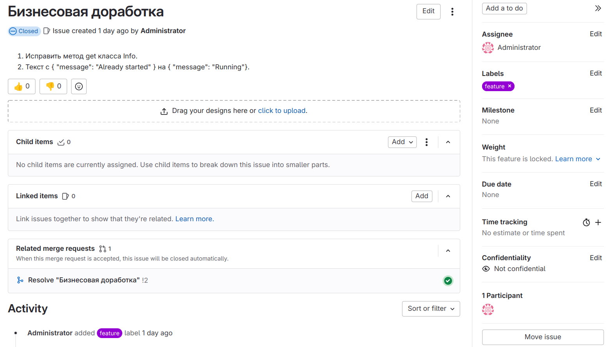
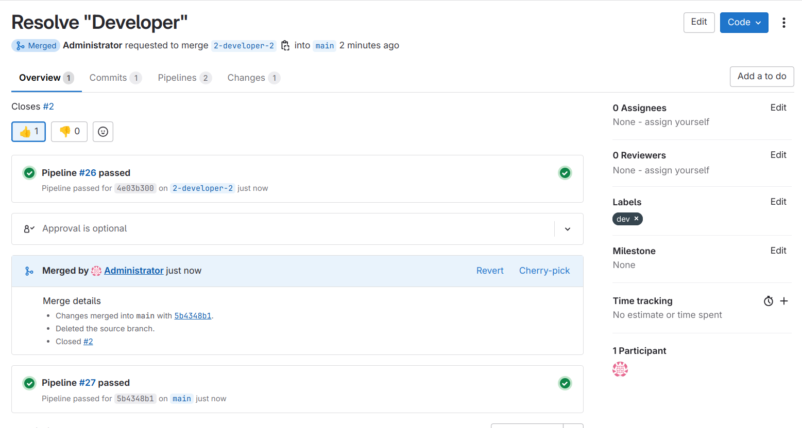
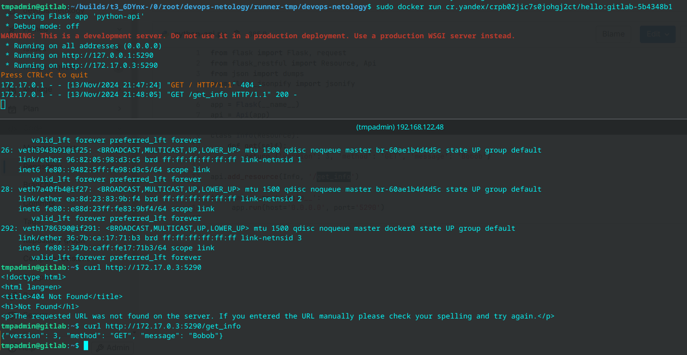

# Домашнее задание к занятию 12 «GitLab»

## Подготовка к выполнению

1. Создал виртуальную машину. Установил GitLab в контейнере [по инструкции](https://docs.gitlab.com/ee/install/docker/installation.html ) .
2. В той же виртуальной машине установил gitlab runner, подключил к серверу gitlab  [по инструкции](https://docs.gitlab.com/runner/install/docker.html) .

3. Создал новый проект. Проект сделал публичным.
4. Создал новый репозиторий в GitLab, наполнил его [файлами](../09-ci-06/).

[docker-compose.yml](./docker-compose.yml)
[python-api.py](./python-api.py)

## Основная часть

### DevOps

В репозитории содержится код проекта на Python. Проект — RESTful API сервис. Ваша задача — автоматизировать сборку образа с выполнением python-скрипта:

1. Образ собирается на основе [centos:7](https://hub.docker.com/_/centos?tab=tags&page=1&ordering=last_updated).
2. Python версии не ниже 3.7.
3. Установлены зависимости: `flask` `flask-jsonpify` `flask-restful`.
4. Создана директория `/python_api`.
5. Скрипт из репозитория размещён в /python_api.
6. Точка вызова: запуск скрипта.
7. При комите в любую ветку должен собираться docker image с форматом имени hello:gitlab-$CI_COMMIT_SHORT_SHA . Образ должен быть выложен в Gitlab registry или yandex registry.

### Решение

Образ собрал на основе python:slim
Попробовал запускать gitlab-runner в контейнере, но не получалось скачать из репозитория gitlab - скорее всего проблема с доступом. Потому поставил gitlab-runner на ОС debian, зарегистрировал. Как среду исполнения выбрал shell.

[Dockerfile](./Dockerfile)
[gitlab-ci.yml](./gitlab-ci.yml)

### Product Owner

Вашему проекту нужна бизнесовая доработка: нужно поменять JSON ответа на вызов метода GET `/rest/api/get_info`, необходимо создать Issue в котором указать:

1. Какой метод необходимо исправить.
2. Текст с `{ "message": "Already started" }` на `{ "message": "Running"}`.
3. Issue поставить label: feature.

### Решение: 

### Developer

Пришёл новый Issue на доработку, вам нужно:

1. Создать отдельную ветку, связанную с этим Issue.
2. Внести изменения по тексту из задания.
3. Подготовить Merge Request, влить необходимые изменения в `master`, проверить, что сборка прошла успешно.
v
### Решение

### Tester

Разработчики выполнили новый Issue, необходимо проверить валидность изменений:

1. Поднять докер-контейнер с образом `python-api:latest` и проверить возврат метода на корректность.
2. Закрыть Issue с комментарием об успешности прохождения, указав желаемый результат и фактически достигнутый.

### Решение

Скачал образ с яндекс регистри.
Запустил контейнер, проверил что данные получены.

## Итог

В качестве ответа пришлите подробные скриншоты по каждому пункту задания:

- файл gitlab-ci.yml;
- Dockerfile; 
- лог успешного выполнения пайплайна;
- решённый Issue.

### Важно 
После выполнения задания выключите и удалите все задействованные ресурсы в Yandex Cloud.