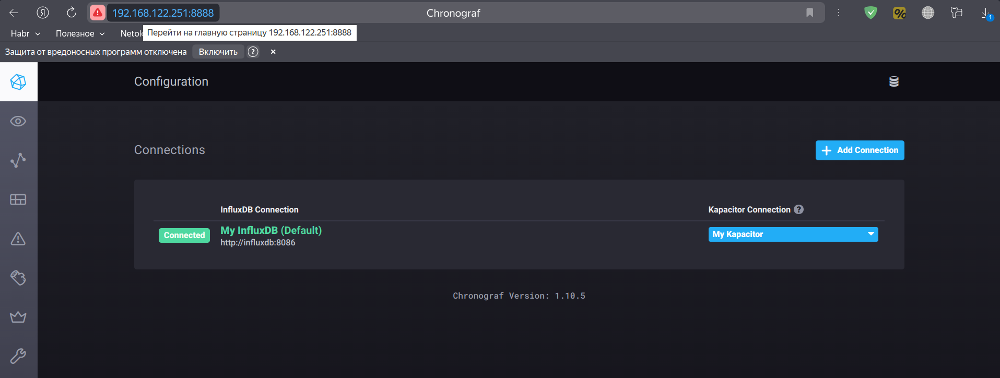
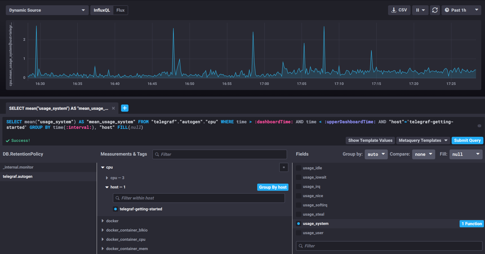
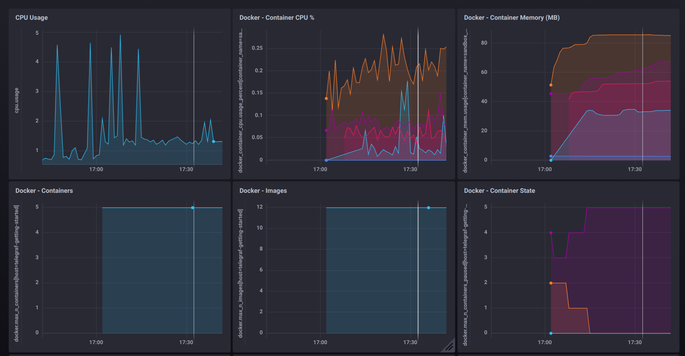
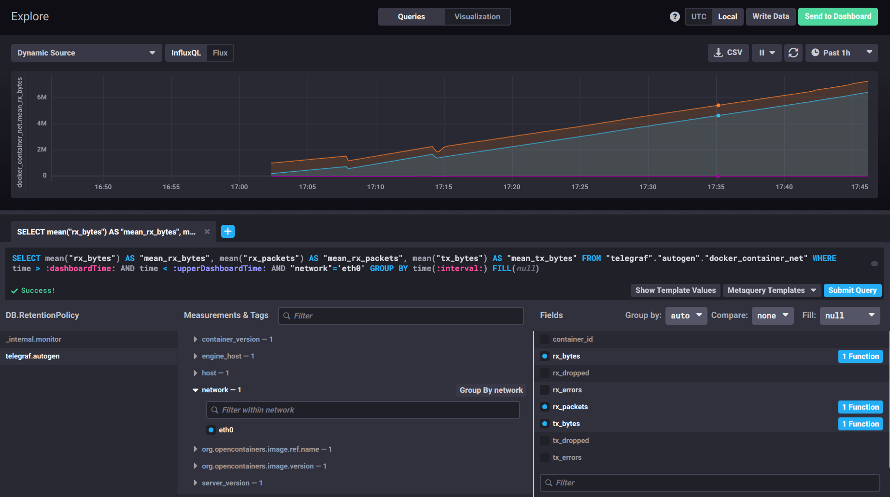
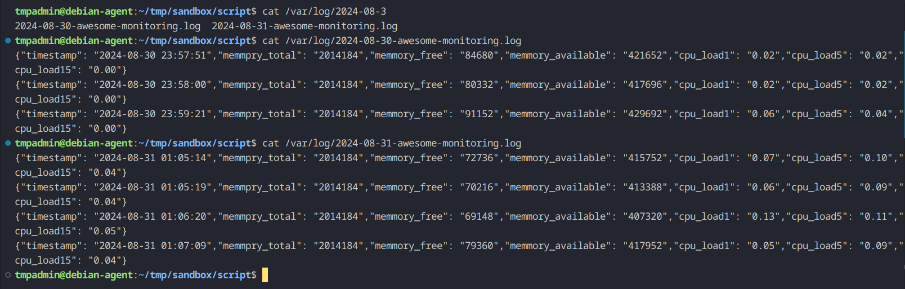

## Домашнее задание к занятию "13.Системы мониторинга"

### Задание 1

#### Вас пригласили настроить мониторинг на проект. На онбординге вам рассказали, что проект представляет из себя платформу для вычислений с выдачей текстовых отчетов, которые сохраняются на диск. Взаимодействие с платформой осуществляется по протоколу http. Также вам отметили, что вычисления загружают ЦПУ. Какой минимальный набор метрик вы выведите в мониторинг и почему?

#### Решение:

Нужно вывести в мониторинг сбор следующих метрик:

- Сбор метрик по CPU (для отслеживания нагрузок платформы на систему и своевременного реагирования на повышенную нагрузку)
- Сбор метрик о утилизации диска (используемое место на диске, на котором установлена платформа + место на диске, на котором хранится выгрузка отчетов + время записи\чтения на диск для отслеживания проблем с диском)
- Сбор метрик по оперативной памяти (для отслеживания утечек и неожиданного поведения системы)
- Сбор метрик по отслеживанию ошибок http (для отслеживания и анализа ошибок в работе платформы)

### Задание 2

#### Менеджер продукта посмотрев на ваши метрики сказал, что ему непонятно что такое RAM/inodes/CPUla. Также он сказал, что хочет понимать, насколько мы выполняем свои обязанности перед клиентами и какое качество обслуживания. Что вы можете ему предложить?

#### Решение:
- Скажу что не нужно ему вникать в метрики, а если хочет, то google в помощь. А если он хочет понимать насколько мы выполняем свои обязанности перед клиентами и какое качество обслуживания, то необходимо внедрить показатели SLO \ SLA \ SLI

### Задание 3

#### Вашей DevOps команде в этом году не выделили финансирование на построение системы сбора логов. Разработчики в свою очередь хотят видеть все ошибки, которые выдают их приложения. Какое решение вы можете предпринять в этой ситуации, чтобы разработчики получали ошибки приложения?

#### Решение:
- Ну если они хотят, то пусть напишут обработчики ошибок и пишут все в лог. Со своей стороны можем предложить сбор логов работы приложения + сбор логов работы системы на основе бесплатных решения (syslog, graylog, elasticsearch и пр.). А если нет возможности выделить ресурсы на дополнительные сервера для разворачивания инфрастуктуры мониторинга на основе бесплатных решений, то, при большом желании и наличии времени, можно даже написать bash-скрипт на самой системе или python-скрипт.

### Задание 4

#### Вы, как опытный SRE, сделали мониторинг, куда вывели отображения выполнения SLA=99% по http кодам ответов. Вычисляете этот параметр по следующей формуле: summ_2xx_requests/summ_all_requests. Данный параметр не поднимается выше 70%, но при этом в вашей системе нет кодов ответа 5xx и 4xx. Где у вас ошибка?

#### Решение: 
- Данная формула учитывает только 200-ые коды ответа (их процент относительно всех запросов), но не учитывает 1xx и 2xx коды ответов. Для более полной картины нужно сложить все 3 показателя и разделить на общее количество.

### Задание 5 

#### Опишите основные плюсы и минусы pull и push систем мониторинга.

#### Решение: 
- PUSH-модель:

  * Плюсы:

    - Данные передаются на сервер при срабатывании события, что позволяет оперативней получать данные. 
    - Со стороны сервера мониторинга большее внимание уделяется хранению и обработке данных. 
    - При потере сетевой связности данные остаются на целевом хосте и могут быть отправлены серверу мониторинга позже.

  * Минусы:

    - Нагрузка на целевую систему. Поскольку данные нужно и собирать и отправлять, то может вызвать дополнительную нагрузку на систему.
    - Дополнительная нагрузка на сетевой трафик. Поскольку при срабатывании события данные отсылаются на сервер, то при большом количестве событий увеличит нагрузку на сеть.
    - Конфигурирование агентов может быть более сложным.
- PULL-модель:
  
  * Плюсы:

    - Централизованное конфигурирование. Упрощает настройку системы мониторинга поскольку конфигурации по сбору метрик хранятся в одном месте, а установка агентов не требует сложного конфигурирования.
    - Снижает нагрузку на целевые системы за счет сбора метрик. Поскольку сервер сам забирает метрики, то целевой хост может обойтись без агента. К примеру, сбор метрик по http, когда сервис сам выкладывает нужные метрики на определенной странице.
    
  * Минусы:

    - При потере сетевой связности, есть вероятность утратить часть данных, если не предусмотрено хранение данных агентом.
    - Повышенное внимание отказоустойчивости сервера.
    - Большая нагрузка на сервер мониторинга за счет сбора метрик.

### Задание 6

#### Какие из ниже перечисленных систем относятся к push модели, а какие к pull? А может есть гибридные?
- Prometheus
- TICK
- Zabbix
- VictoriaMetrics
- Nagios

#### Решение:

- Prometheus        pull
- TICK              pull
- Zabbix            pull-push
- VictoriaMetrics   pull
- Nagios            pull

### Задание 7

#### Склонируйте себе репозиторий и запустите TICK-стэк, используя технологии docker и docker-compose. В виде решения на это упражнение приведите скриншот веб-интерфейса ПО chronograf (http://localhost:8888).

#### Решение: 



### Задание 8

#### Перейдите в веб-интерфейс Chronograf (http://localhost:8888) и откройте вкладку Data explorer. 
#### - Нажмите на кнопку Add a query. 
#### - Изучите вывод интерфейса и выберите БД telegraf.autogen. 
#### - В measurments выберите cpu->host->telegraf-getting-started, а в fields выберите usage_system. Внизу появится график утилизации cpu.
#### - Вверху вы можете увидеть запрос, аналогичный SQL-синтаксису. Поэкспериментируйте с запросом, попробуйте изменить группировку и интервал наблюдений. 
#### Для выполнения задания приведите скриншот с отображением метрик утилизации cpu из веб-интерфейса.

#### Решение:



### Задание 9

#### Изучите список telegraf inputs. Добавьте в конфигурацию telegraf следующий плагин - docker:

```
[[inputs.docker]]
  endpoint = "unix:///var/run/docker.sock"
```
#### Дополнительно вам может потребоваться донастройка контейнера telegraf в docker-compose.yml дополнительного volume и режима privileged:

```
  telegraf:
    image: telegraf:1.4.0
    privileged: true
    volumes:
      - ./etc/telegraf.conf:/etc/telegraf/telegraf.conf:Z
      - /var/run/docker.sock:/var/run/docker.sock:Z
    links:
      - influxdb
    ports:
      - "8092:8092/udp"
      - "8094:8094"
      - "8125:8125/udp"

```

#### После настройке перезапустите telegraf, обновите веб интерфейс и приведите скриншотом список measurments в веб-интерфейсе базы telegraf.autogen . Там должны появиться метрики, связанные с docker.

#### Факультативно можете изучить какие метрики собирает telegraf после выполнения данного задания.

#### Решение: 




## Дополнительное задание (со звездочкой*) - необязательно к выполнению

#### Вы устроились на работу в стартап. На данный момент у вас нет возможности развернуть полноценную систему мониторинга, и вы решили самостоятельно написать простой python3-скрипт для сбора основных метрик сервера. Вы, как опытный системный-администратор, знаете, что системная информация сервера лежит в директории /proc. Также, вы знаете, что в системе Linux есть планировщик задач cron, который может запускать задачи по расписанию.

Суммировав все, вы спроектировали приложение, которое:

 - является python3 скриптом
 - собирает метрики из папки /proc
 - складывает метрики в файл 'YY-MM-DD-awesome-monitoring.log' в директорию /var/log (YY - год, MM - месяц, DD - день)
 - каждый сбор метрик складывается в виде json-строки, в виде:
 - timestamp (временная метка, int, unixtimestamp)

    - metric_1 (метрика 1)
    - metric_2 (метрика 2)
    - ...
    - metric_N (метрика N)
 - сбор метрик происходит каждую 1 минуту по cron-расписанию

Для успешного выполнения задания нужно привести:

 - работающий код python3-скрипта,
 - конфигурацию cron-расписания,
 - пример верно сформированного 'YY-MM-DD-awesome-monitoring.log', имеющий не менее 5 записей,

P.S.: количество собираемых метрик должно быть не менее 4-х. P.P.S.: по желанию можно себя не ограничивать только сбором метрик из /proc.

В веб-интерфейсе откройте вкладку Dashboards. Попробуйте создать свой dashboard с отображением:

 - утилизации ЦПУ
 - количества использованного RAM
 - утилизации пространства на дисках
 - количество поднятых контейнеров
 - аптайм
 - ...
 - фантазируйте)

#### Решение: 

Написал bash-скрипт по сбору метрик:

[get_metrics.sh](./get_metric.sh)

Создаем службу для запуска скрипта (это позволит дополнительно просматривать логи работы службы через journalctl):

[get-metrics.service](./get-metrics.service)

Создаем таймер для запуска службы по расписанию (раз в минуту):

[get-metrics.timer](./get-metrics.timer)

Просмотр логов в терминале:

