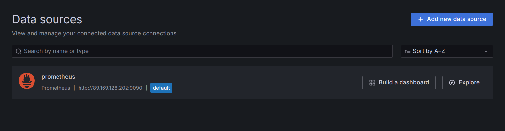
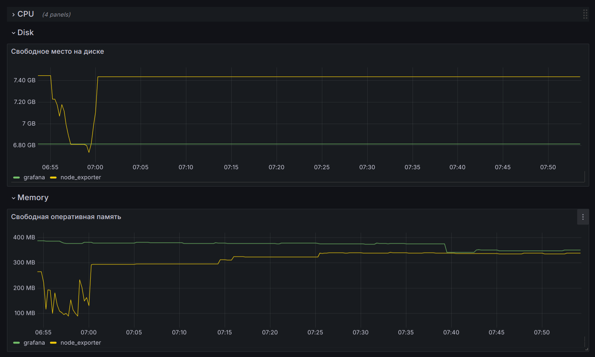
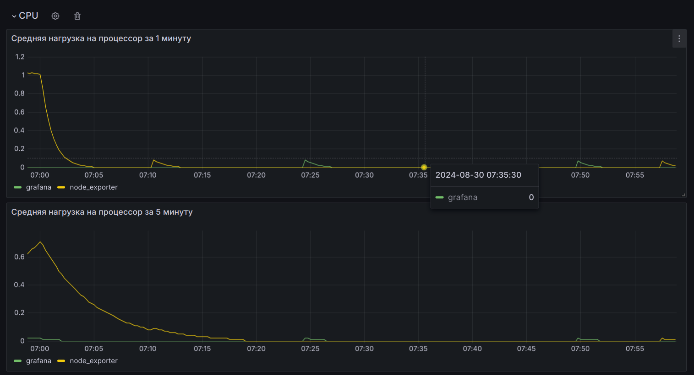
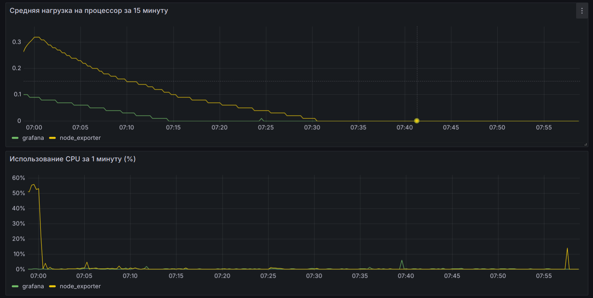
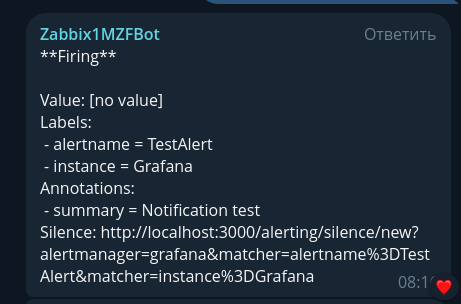
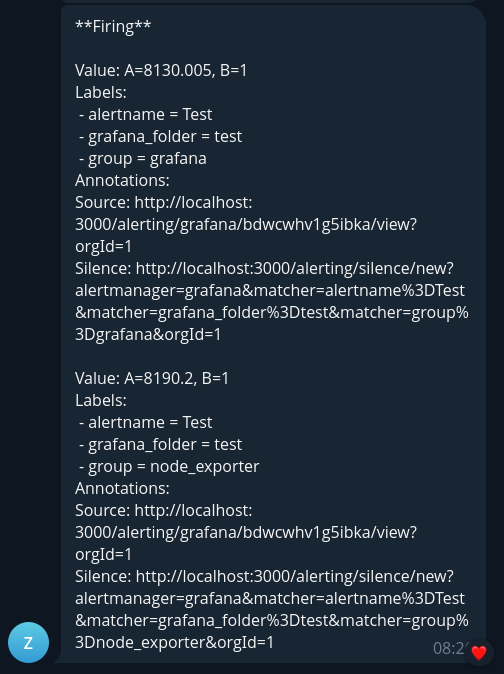

## Домашнее задание к занятию 14 «Средство визуализации Grafana»

### Задание 1

Подключите поднятый вами prometheus, как источник данных.

#### Решение:

Добавлен к Grafana источник данных prometheus:

### Задание 2

Изучите самостоятельно ресурсы:

1. [PromQL tutorial for beginners and humans](https://valyala.medium.com/promql-tutorial-for-beginners-9ab455142085).
1. [Understanding Machine CPU usage](https://www.robustperception.io/understanding-machine-cpu-usage).
1. [Introduction to PromQL, the Prometheus query language](https://grafana.com/blog/2020/02/04/introduction-to-promql-the-prometheus-query-language/).

Создайте Dashboard и в ней создайте Panels:

- утилизация CPU для nodeexporter (в процентах, 100-idle);
- CPULA 1/5/15;
- количество свободной оперативной памяти;
- количество места на файловой системе.

#### Решение:

Promql-запросы для выдачи этих метрик:

- утилизация CPU для nodeexporter (в процентах, 100-idle):

    `100 - (avg by(group) (irate(node_cpu_seconds_total{mode="idle"}[1m]) * 100))`

- CPULA 1/5/15:

    `node_load1`

    `node_load5`

    `node_load15`

- количество свободной оперативной памяти:

    `node_filesystem_free_bytes{fstype!="tmpfs"}`

- количество места на файловой системе:

    `node_memory_MemFree_bytes`

#### Скриншоты Dashboard:

### Задание 3

#### Решение: 

Настроен канал нотификации telegram:

### Задание 4

#### Решение:

JSON-файл Dashboard Grafana:

[node_exporter.json](./node_exporter.json)

